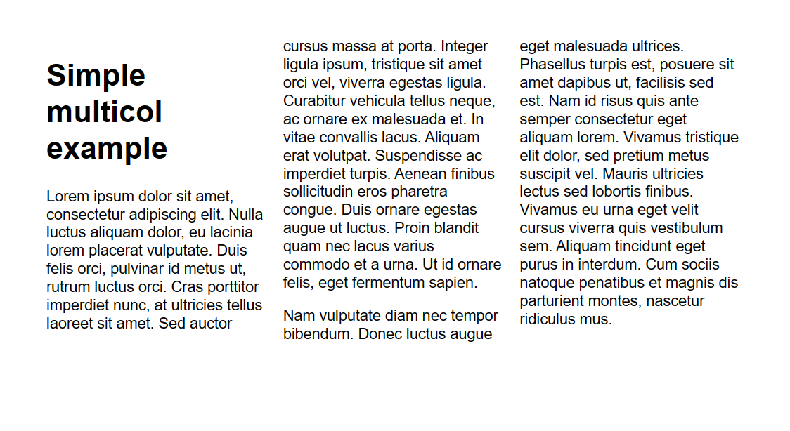
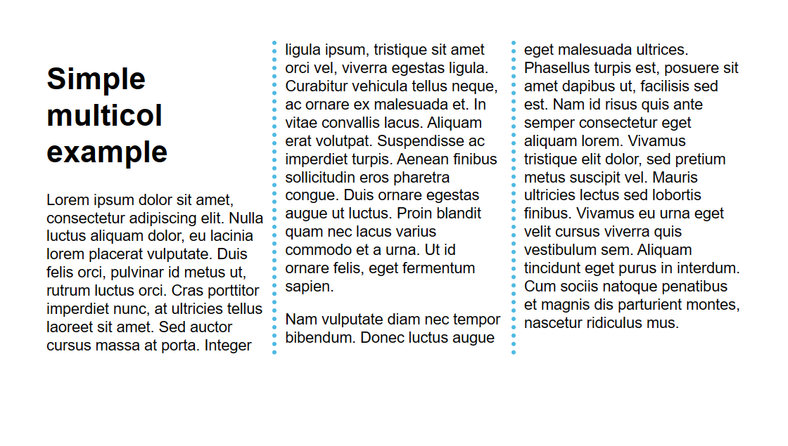
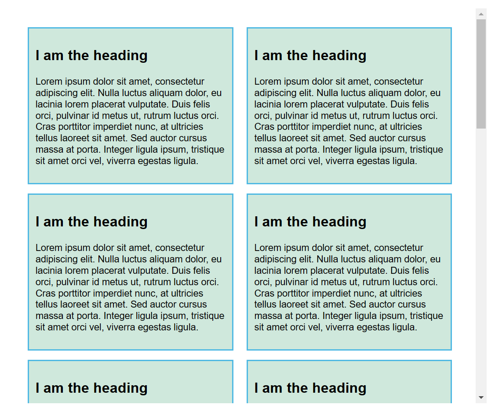

多列布局，通常也简写为 multicol

# 三列布局

通过这两个属性开启 multicol: `column-count` 或者 `column-width`

`column-count` 将创建指定数量的列

```css
.container {
  column-count: 3;
}
```

创建的这些列具有弹性的宽度 — 由浏览器计算出每一列分配多少空间



# 设置列宽

使用 column-width

```css
.container {
  column-width: 200px;
}
```

# 给多列增加样式

- 用 `column-gap` 改变列间间隙
- 用 `column-rule` 在列间加入一条分割线

```css
.container {
  column-count: 3;
  column-gap: 20px;
  column-rule: 4px dotted rgb(79, 185, 227);
}
```



> 值得一提的是这条分割线本身并不占用宽度

# 多列卡片

```css
.container {
  column-width: 250px;
  column-gap: 20px;
}

.card {
  background-color: rgb(207, 232, 220);
  border: 2px solid rgb(79, 185, 227);
  padding: 10px;
  margin: 0 0 1em 0;
}
```



