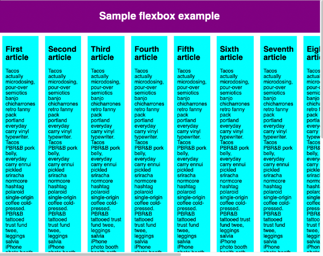
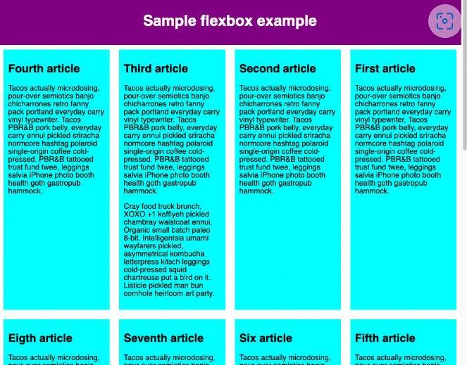
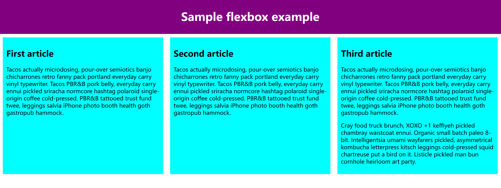
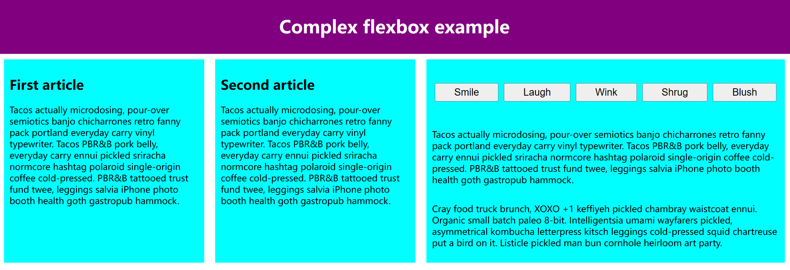
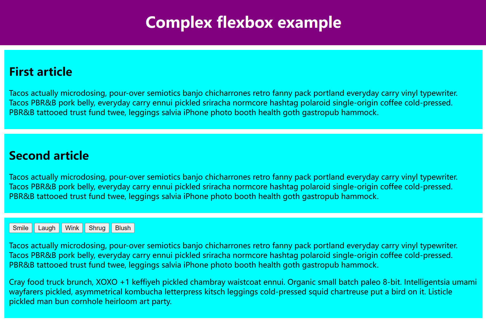
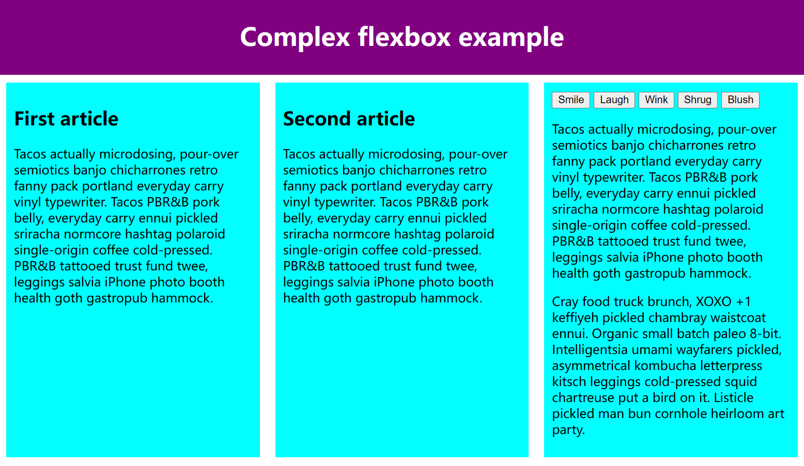
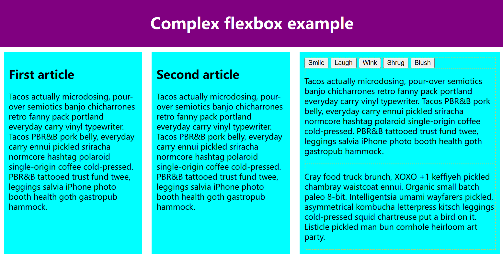
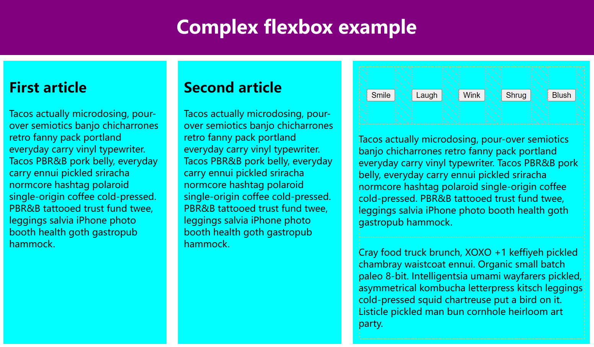
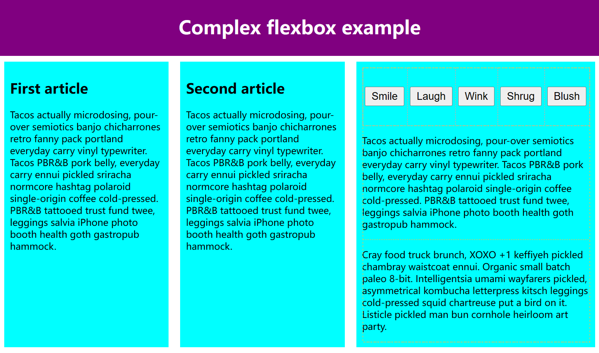

# 启用flex

在父元素添加 `display: flex`

将父容器改为 flex 布局后，他的直接子项会变为 flex 项

# 主轴方向

flex-direction 可以指定主轴的方向, 它默认值是 row 横向

将 `flex-direction: column` 加到父容器，主轴就会变成纵向


# 元素溢出

如果元素太多，一行就放不下



在父元素添加 `flex-wrap: wrap` 说明允许换行

在子元素添加 `flex: 200px` 说明每个元素至少宽 200px



# flex-flow缩写

```css
flex-flow: row wrap;
```

# 动态尺寸

假设现在有三个卡片，给三个卡片都设置 `flex: 1` 意思就是3个元素的比例为 1：1：1

三个卡片占用空间相等，占用的空间是在设置 padding 和 margin 之后剩余的空间



现在给第三个卡片设置 `flex: 2` 比例就变成了 1：1：2


你还可以指定 flex 的最小值 `flex: 1 200px`

这让卡片首先给出 200px 的可用空间，然后，剩余的可用空间将根据分配的比例共享”

<!-- # flex 缩写与全写

flex 缩写可以指定三个不同属性

1. 比例，全写 `flex-grow`
2. 溢出量，全写 `flex-shrink` 阻止元素溢出容器（高级功能）
3. 最小值，全写 `flex-basis`

> 建议使用缩写 -->

# 水平和垂直对齐

给父元素添加 `align-items` 垂直对齐， `justify-content` 水平对齐

## align-items

- 默认 `stretch` 上下拉伸填满父容器
- `center`
- `flex-start` 或 `flex-end`

> 给子项添加 `align-self: flex-end` 可以覆盖 `align-items` 的属性

## justify-content

- 默认 `flex-start`
- `flex-end`
- `center`
- `space-around` 均匀分布，在两端留下空间
- `space-between` 均匀分布，不在两端留下空间
<!-- - `space-evenly` 均匀分布，在两端留下空间，和间隙大小相同 -->

# flex 项排序

- 通过 `order`来排序，所有 flex 项默认的 order 值是 0
- `order` 值越大越靠后

负值也是可以的，这样就排在最前了
```css
button:last-child {
  order: -1;
}
```

# flex 嵌套

弹性盒子也能创建一些颇为复杂的布局。设置一个元素为 flex 项，那么他同样成为一个 flex 容器，它的孩子（直接子节点）也表现为弹性盒子。



现在让我们一步一步来，这是最初的样子



## 第一步

我们设置 `<section>` 的子节点布局为弹性盒子

```css
section {
  display: flex;
}
```

可以看到三个卡片已经水平均匀分布了



## 第二步
 
给子元素设置 flex 值。这里第三个 `<article>` 元素的子节点的布局同样为 flex，属性值为列布局

```css
article {
  flex: 1 200px;
}

article:nth-of-type(3) {
  flex: 3 200px;
  display: flex;
  flex-flow: column;
}
```



## 第三步

选择第一个 `<div>`。首先使用 `flex: 1 100px`; 简单的给它一个最小的高度 100px，然后设置它的子节点（`<button>` 元素）为 flex 布局。在这里我们将它们放在 wrap row 中，再使它们居中对齐。

```css
article:nth-of-type(3) div:first-child {
  flex: 1 100px;
  display: flex;
  flex-flow: row wrap;
  align-items: center;
  justify-content: space-around;
}
```



## 第四步

给按钮设置大小，有意思的是我们给它一个值为 1 的 `flex` 属性。如果你调整浏览器窗口宽度，你会看到这是一个非常有趣的效果。按钮将尽可能占用最多的空间，尽可能多的堆在同一条线上，但是当它们不再适合在同一条线上，他们中的一些会到下一行去(这是因为父容器的wrap属性)

```css
button {
  flex: 1;
  margin: 5px;
  font-size: 18px;
  line-height: 1.5;
}
```

