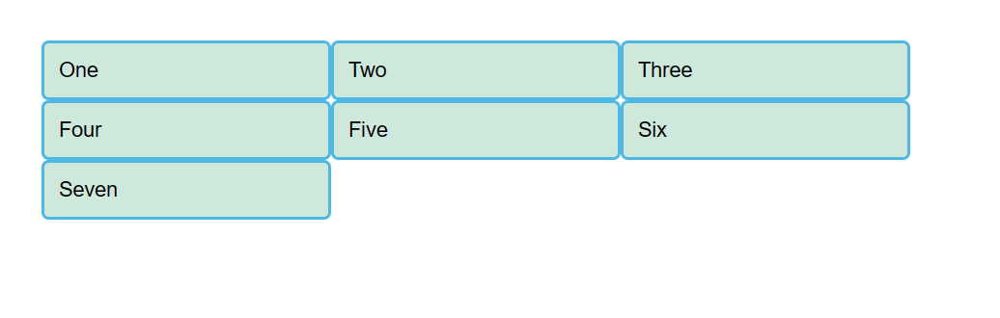
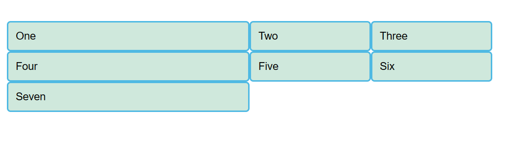
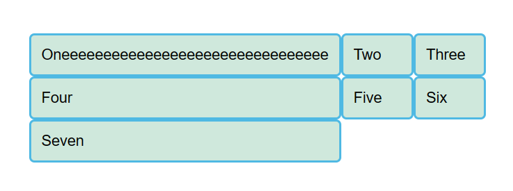
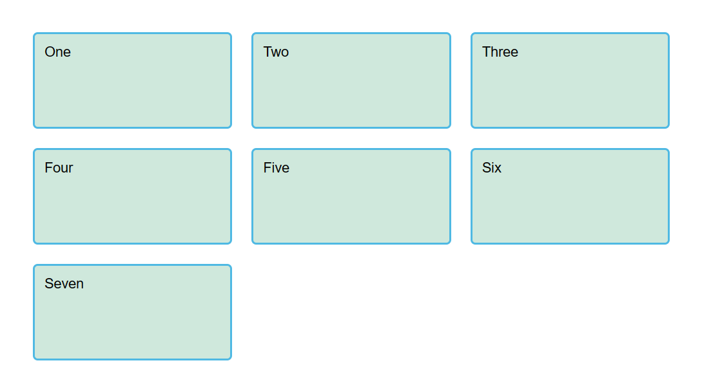
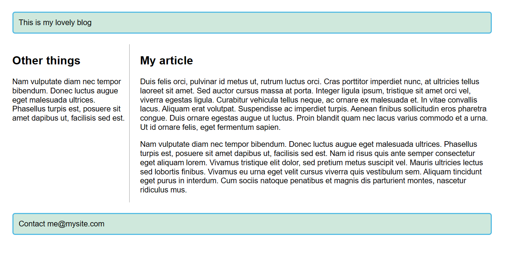
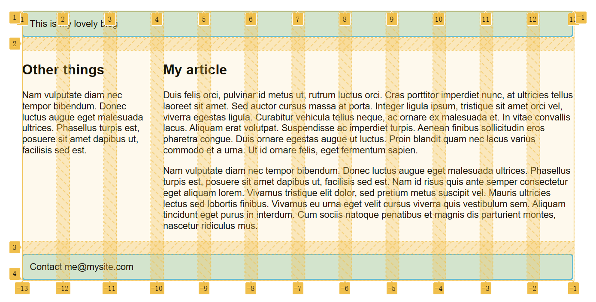

# 启用grid

在父元素添加 `display: grid` 来定义grid布局

加三个宽度为200px的列，用百分比也可以

```css
.container {
    display: grid;
    grid-template-columns: 200px 200px 200px;
}
```



# 单位 fr

表示可用空间的比例： `grid-template-columns: 2fr 1fr 1fr` 比例为2：1：1



可以和一般长度单位混用： `grid-template-columns: 300px 2fr 1fr` 第一列宽度是300px，剩下的两列会根据除去300px后的可用空间按比例分配。

> 注意：fr单位分配的是可用空间而非所有空间，如果格子中内容变多了，那么可用空间就会减少



# 间隙 gap

使用 `grid-gap` 可以设定列间隙和行间隙（不能用fr）

```css
grid-gap: 20px 10px;
```

> `grid-gap` 是老名字，现在逐渐被 `gap` 取代，也可以写 `row-gap` 这种

# 重复构建 repeat

`grid-template-columns: repeat(3, 1fr);` 相当于填入了 `1fr 1fr 1fr`

`repeat(2, 2fr 1fr)` 相当于填入了 `2fr 1fr 2fr 1fr`

# 显式网格与隐式网格

一句话，通过 `grid-auto-rows: 100px` 来设置固定行高

如果没有行高，隐式网格会自适应设置行高

简单来说，隐式网格就是为了放显式网格放不下的元素，根据已经定义的显式网格自动生成的网格部分。

# minmax 函数

`grid-auto-rows: minmax(100px, auto)` 表示行高根据内容自动调整，最小为100px

# 自动使用多列填充

在repeat函数中，用 `auto-fill` 来替代确定列的重复次数。第二个参数用minmax函数来设定，列宽最小为200px，最大为1fr

```css
.container {
  display: grid;
  grid-template-columns: repeat(auto-fill, minmax(200px, 1fr));
  grid-auto-rows: minmax(100px, auto);
}
```



随着容器宽度的改变，网格会自动根据容器宽度进行调整，每一列的宽度总是大于200px，并且容器总会被列填满。

# 基于线的元素放置

我们根据分隔线来放置元素，通过以下属性来指定从第几条线开始或结束

- grid-column: 1 / 3
- grid-row

1开始到3结束，说明从第一条线到第三条线中的2格合并了

> 用-1定位到最后一条分隔线，用负数来指定倒数的某一条分隔线。但对于隐式网格，-1不一定能定位到最后一条分隔线。

# 使用 grid-template-areas 属性放置元素

你要命名一些元素，并在属性中使用这些名字作为一个区域

```css
.container {
  display: grid;
  grid-template-areas:
      "header header"
      "sidebar content"
      "footer footer";
  grid-template-columns: 1fr 3fr;
  grid-gap: 20px;
}
header {
  grid-area: header;
}
article {
  grid-area: content;
}
aside {
  grid-area: sidebar;
}
footer {
  grid-area: footer;
}
```


grid-template-areas属性的使用规则：

- 你需要填满网格的每个格子
- 对于某个横跨多个格子的元素，重复写上那个元素grid-area属性定义的区域名字
- 所有名字只能出现在一个连续的矩形区域
- 使用 `.` 符号，让一个格子留空

虽然代码变长了，但是这种方法更加直观，对于复杂的布局也能迅速创建

# 用grid排版框架

数格子还不简单？

```css
header {
  grid-column: 1 / 13;
  grid-row: 1;
}

article {
  grid-column: 4 / 13;
  grid-row: 2;
}

aside {
  grid-column: 1 / 4;
  grid-row: 2;
}

footer {
  grid-column: 1 / 13;
  grid-row: 3;
}
```

