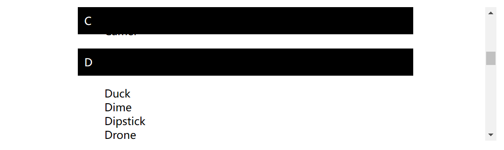

# 相对定位 relative

`position: relative`

使用 top, bottom, left, 和 right 来精确指定要将定位元素移动到的位置

```css
top: 30px;
left: 30px;
```

它与静态定位非常相似，占据在正常的文档流中，除了你仍然可以修改它的最终位置，包括让它与页面上的其他元素重叠。

# 绝对定位 absolute

绝对定位将元素固定在相对于其位置最近的祖先。（如果没有，则为初始包含它的块）

但如果，父元素使用了 `relative` 属性，子元素就会跟随父元素进行绝对定位

# z轴 z-index

`z-index: 1` 也就是元素所在的图层数

数字越大，图层越高

# 固定定位 fixed

固定定位固定元素总是相对于浏览器视口

# 粘性定位 sticky

它允许被定位的元素表现得像相对定位一样，直到它滚动到某个阈值点为止，此后 `top left` 等属性就会生效

```css
dt {
  position: sticky;
  top: 0;
}
```

每个后续标题将替换前一个标题，直到它向上滚动到该位置

