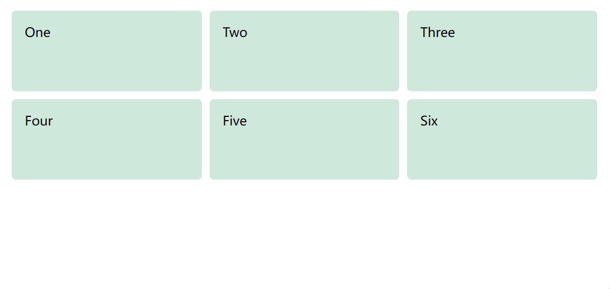
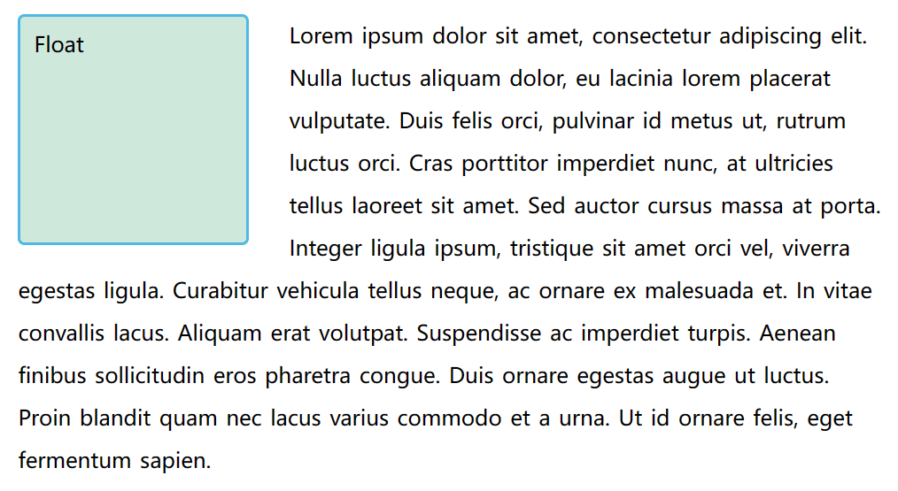

# display 属性

在 css 中实现页面布局的主要方法是设定display属性的值。此属性允许我们更改默认的显示方式。

# Flex

弹性盒子布局，横向或是纵向的一维页面布局

<!-- 在父元素上应用 display: flex ，所有子元素都将会按照 flex 进行布局

在所有子元素上添加 flex: 1，这会使得所有的子元素都伸展并填充容器 -->

# Grid

网格布局，用于同时在两个维度上把元素按行和列排列

<!-- 在父元素添加 display: grid ，使用 grid-template-rows 和 grid-template-columns 两个属性定义一些行和列的轨道，三个1fr的列，还有两个100px的行
```css
.wrapper {
    display: grid;
    grid-template-columns: 1fr 1fr 1fr;
    grid-template-rows: 100px 100px;
    grid-gap: 10px;
}
``` -->


# Float

实现文字环绕效果



# Position

五种定位：
1. static 静态：默认
2. relative 相对
3. absolute 绝对
4. fixed 固定
5. sticky 粘性
