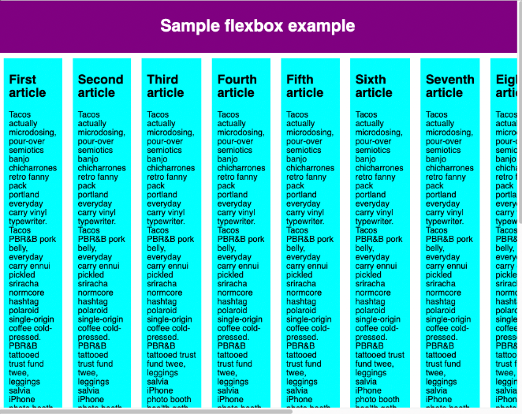

# 主轴方向

flex-direction 可以指定主轴的方向, 它默认值是 row

将这个加到父容器，就变成纵向
```css
flex-direction: column;
```

# 元素溢出


父元素添加 `flex-wrap: wrap`

子元素添加 `flex: 200px;`

`flex：200px` 声明意味着每个声明将至少为 200px 宽

解决


# flex-flow缩写

```css
flex-direction: row;
flex-wrap: wrap;
```

```css
flex-flow: row wrap;
```

# 动态尺寸

假设现在有三个卡片，给所有卡片设置 `flex: 1` 。这是一个无单位的比例值，表示每个 flex 项沿主轴的可用空间大小

那么三个卡片占用空间都是相等的，占用的空间是在设置 padding 和 margin 之后剩余的空间


现在给第三个卡片设置 `flex: 2` 

第三个卡片占用了两倍的可用宽度和剩下的一样——现在总共有四个比例单位可用。前两个 flex 项各有一个，因此它们占用每个可用空间的 1/4。第三个有两个单位，所以它占用 2/4 或者说是 1/2 的可用空间。


你还可以指定 flex 的最小值
```css
article {
  flex: 1 200px;
}

article:nth-of-type(3) {
  flex: 2 200px;
}
```
这表示“每个 flex 项将首先给出 200px 的可用空间，然后，剩余的可用空间将根据分配的比例共享”。

# flex：缩写与全写