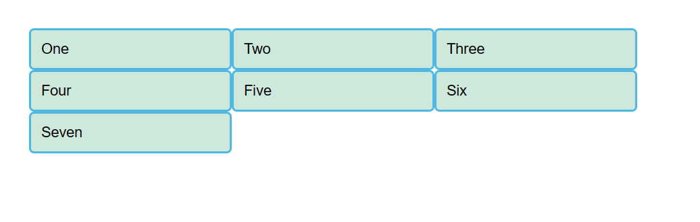
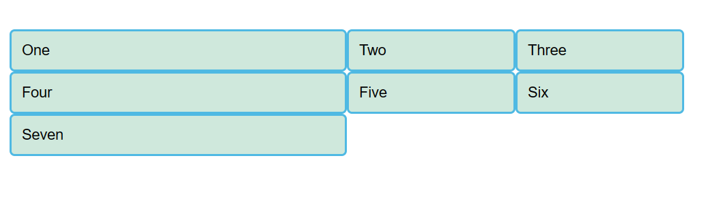
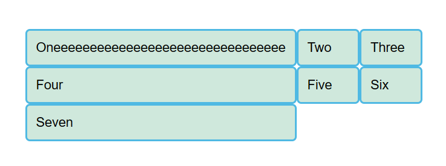

一个网格通常具有许多的列（column）与行（row），以及间隙，这个间隙一般被称为沟槽（gutter）

# 启用grid

在父元素添加 `display: grid` 来定义grid布局

在定义网格后，网页并不会马上发生变化。因为 `display: grid` 的声明只创建了一个只有一列的网格

给刚定义的网格加一些列。那就让我们加三个宽度为200px的列.这里可以用任何长度单位，包括百分比

```css
.container {
    display: grid;
    grid-template-columns: 200px 200px 200px;
}
```



# fr单位

除了长度和百分比，我们也可以用fr这个单位来灵活地定义网格的行与列的大小。

这个单位表示了可用空间的一个比例，下面就是调成了1：1：1

```css
.container {
    display: grid;
    grid-template-columns: 1fr 1fr 1fr;
}
```


另外，fr可以与一般的长度单位混合使用，比如`grid-template-columns: 300px 2fr 1fr`

那么第一列宽度是300px，剩下的两列会根据除去300px后的可用空间按比例分配。

> 注意：fr单位分配的是可用空间而非所有空间，如果格子中内容变多了，那么可用空间就会减少



# 间隙

使用 `grid-gap` 可以同时设定列间隙和行间隙（不能使用fr单位）

```css
grid-gap: 20px 10px;
```

> `grid-gap` 是老名字，现在逐渐被 `gap` 取代，也可以把两个属性都写上

# 重复构建行/列

使用 `repeat` 来重复构建具有某些宽度配置的某些列

`grid-template-columns: repeat(3, 1fr);` 相当于填入了 `1fr 1fr 1fr`

`repeat(2, 2fr 1fr)` 相当于填入了 `2fr 1fr 2fr 1fr`

# 显式网格与隐式网格

显式网格是我们用grid-template-columns 或 grid-template-rows 属性创建的。而隐式网格则是当有内容被放到网格外时才会生成的。显式网格与隐式网格的关系与弹性盒子的 main 和 cross 轴的关系有些类似。

