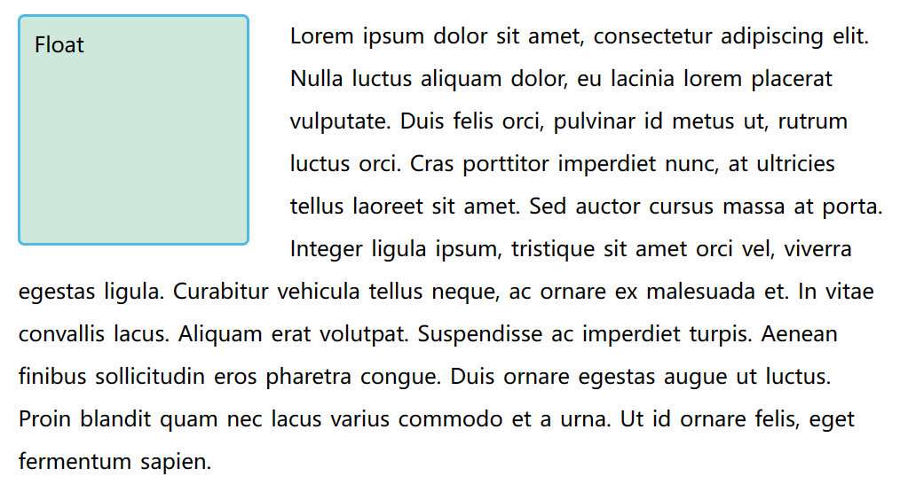
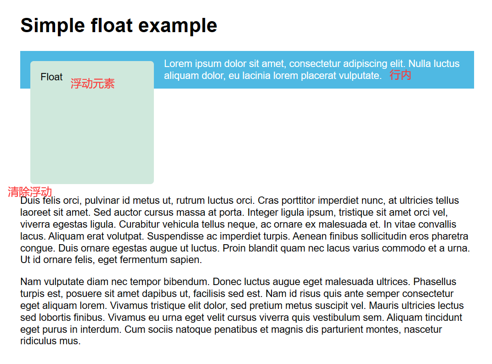
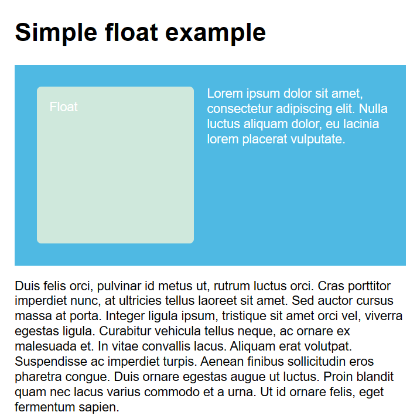

# 启用float

给盒子设置 `float: left` 的属性，盒子启用float布局，脱离正常文档流

# 清除浮动

给需要清除的元素加上 `clear: left` 来清除左浮动，`clear: both` 代表清除两侧的浮动

# 清除浮动元素周围的盒子

为了实现这样的效果

给浮动元素及段落套上大div，设置大div的背景为蓝色，在后方添加空的div，清除空div的浮动

一个较为现代的方案是给大div添加 `display: flow-root` 属性